  

---

## 👨‍💻 About Me

I’m a software developer focused on building strong foundations across systems and web development, with a particular interest in understanding how embedded systems work.
I’m currently exploring the path of becoming a full-stack developer, combining problem-solving and creativity to build complete and impactful solutions.

* 🔭 Currently collaborating on a platform featuring educational games that teach digital security concepts to students aged 6 to 20
* 🌱 Expanding my knowledge in Embedded Systems
* 🏠 Building a home automation application to control and monitor my house from my phone
* 📧 [Contact me via email](mailto:marco_miguelote@hotmail.com)

---

## ⚡ Tech Stack

  
  
  
  
  
  
  

---

## 🚀 Selected Projects

### 🧠 Systems & Low-Level

* [minishell](https://github.com/mmiguelo/minishell) — Custom shell with parsing, execution, and process management
* [pipex](https://github.com/mmiguelo/pipex) — Unix pipe simulation and process chaining
* [philosophers](https://github.com/mmiguelo/philosophers) — Multithreading and synchronization (Dining Philosophers problem)

### ⚙️ C Foundations & Algorithms

* [libft](https://github.com/mmiguelo/LIBFT) — Custom implementation of the C standard library
* [ft_printf](https://github.com/mmiguelo/ft_printf) — Reimplementation of printf with variadic functions
* [get_next_line](https://github.com/mmiguelo/Get_next_Line) — Efficient file reading, line by line
* [push_swap](https://github.com/mmiguelo/Push_Swap) — Sorting algorithm optimization with constrained operations

### 🎮 Graphics & Rendering

* [cub3d](https://github.com/mmiguelo/Cub3d) — Raycasting engine inspired by Wolfenstein 3D

### 🌐 Web & Infrastructure

* [webserv](https://github.com/mmiguelo/Webserv) — HTTP server built in C++

---

  
📊 GitHub Stats

   
  

    
     
  

---

  

  If you liked this 🐍 animation, check <a href="https://github.com/mmiguelo/profile_snake_animation">here</a> to learn how to create it.

